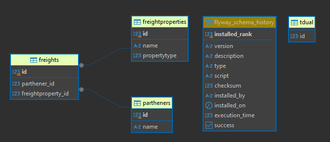

# Projeto AzShip 
    adm-azs-shipping

# GitHub do Projeto
    https://github.com/celogp/adm-azs-shipping.git

# Pré-requisito
    Docker instalado para subir ou gerar as imagens.
    Java 21 com mavem se for mexer no projeto.

# Diagrama das tabelas
    

# Clone o projeto em uma pasta de trabalho
    git clone https://github.com/celogp/adm-azs-shipping.git
    Entrar na pasta principal do projeto e abrir em sua ide favorita.

# Gerar a imagem docker.
    A) Imagem pronta no hub.docker.com
		0.Baixar a imagem
			docker pull celogp/adm-azs-shipping-app	
			
		1.Subir a imagem  
		   docker-compose up -d
	
	B) Contruição da imagem pelo repositório
		0.Acessar a pasta principal do projeto por algum terminal.

		1.Gerar o JAR da aplicação**
		   No terminal, rode o comando abaixo no diretório do projeto:
		   ./mvnw clean package

			Isso irá gerar o arquivo JAR na pasta `target`.

		2.Construir e subir os containers**  
		   No mesmo diretório do arquivo `docker-compose.yml`, rode:

		   docker-compose up --build

# Em ambas opções de imagens irá acessar a API
    A aplicação estará disponível em [http://localhost:8080](http://localhost:8080).
    O PostgreSQL estará rodando na porta `5432`.

# Chamada da requisições
    -Create 
        curl --request POST \
        --url http://localhost:8080/api/Freights \
        --header 'Content-Type: application/json' \
        --header 'User-Agent: insomnia/10.1.1' \
        --data '{
        "parthener" :  {"id":"1"},
        "freightProperty" : {"id": "2"}
        }'

    -Update
        curl --request PUT \
        --url http://localhost:8080/api/Freights \
        --header 'Content-Type: application/json' \
        --header 'User-Agent: insomnia/10.1.1' \
        --data '{
        "id" : "1",
        "parthener" :  {"id":"2"},
        "freightProperty" : {"id": "3"}
        }'

    -FindAll
        curl --request GET \
        --url 'http://localhost:8080/api/Freights?pageNumber=0' \
        --header 'User-Agent: insomnia/10.1.1'

    -FindById
        curl --request GET \
        --url http://localhost:8080/api/Freights/1 \
        --header 'User-Agent: insomnia/10.1.1'

    -FindByParthener
        curl --request GET \
        --url 'http://localhost:8080/api/Freights/Parthener/1?pageNumber=0' \
        --header 'User-Agent: insomnia/10.1.1'

    -Delete 
        curl --request DELETE \
        --url http://localhost:8080/api/Freights/1 \
        --header 'User-Agent: insomnia/10.1.1'

# Tecnologias
    Java21
    Spring Boot
    Flayway
    Spring Jpa
    Docker
    Docker-Compose
    PostGreSql